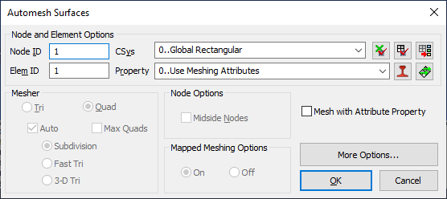
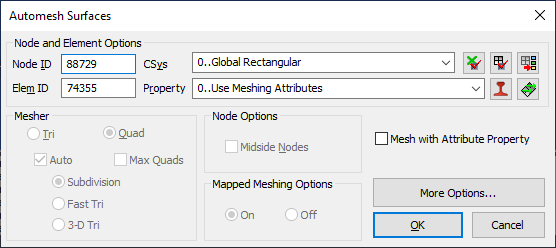

# Femap---Set-Next-Node-and-Element-ID-to-High
Force Femap to create nodes and elements starting at the next highest ID above the existing nodes and elements.

This macro is license-free and released into the public domain.

See also: [How to use Femap Scripts](https://github.com/aaronjasso/How_to_use_Femap_Scripts) and [The List of my Femap Scripts](https://github.com/aaronjasso/My-Femap-Scripts)

---

Often while meshing, I like to reserve low IDs for "special" nodes and elements. Like constraints, or maybe certain loaded elements. So I'll usually start meshing at ID 100. But as I continue meshing additional geometry, the mesher will frequently auto-populate the node and element ID fields with the lowest ID available, which is usually 1. This macro sets the `next available ID` in Femap for nodes and elements to the first ID available after the existing nodes and elements.

For example, in this model:
```Unassigned Nodes: 1-100 (I don't want to use these IDs yet, but Femap doesn't know this)
Existing Nodes: 101 - 88,728

Unassigned Elements: 1-100 (I want to reserve these for later)
Existing Elements: 101-74,354
```
The mesher will often look like this



After running this macro, the mesher will look like this instead



Note: You can manually change the fields in the mesher, but with large models it becomes difficult to keep track of what IDs are available. This macro makes it simple.
